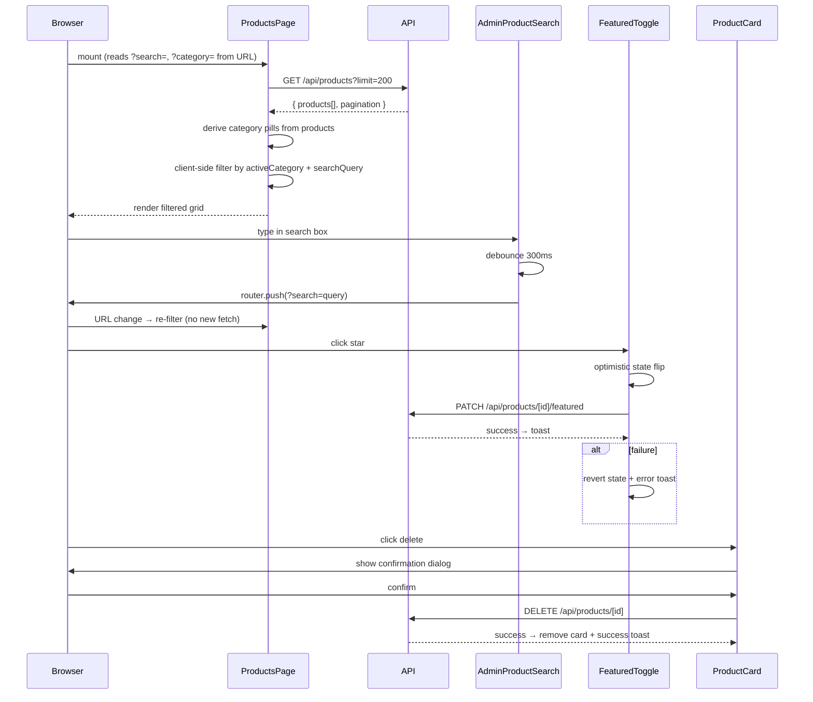
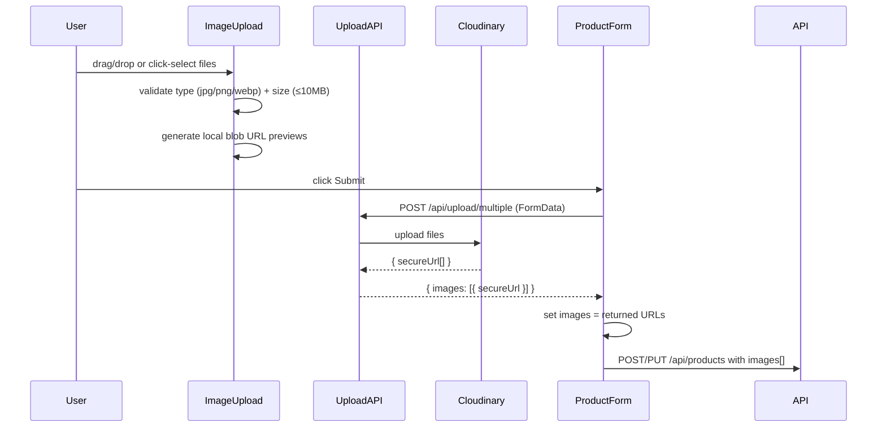

# Design Document: Admin Dashboard Redesign

## Overview

This redesign replaces the existing admin products table with a card-based UI across products and categories. It introduces a new `Category` Mongoose model, dedicated CRUD API routes for categories and individual products, multi-image Cloudinary uploads, URL-synced search with debounce, optimistic featured toggling, and toast notifications via `sonner`.

The existing sidebar in `app/admin/layout.tsx` is preserved without modification. The default admin redirect changes from `/admin/dashboard` to `/admin/products`. All new pages and components live under `app/admin/`.

### Key Design Decisions

- **Client-side filtering over server-side pagination**: Products are fetched in a single request (up to 200) and filtered/searched client-side. This avoids round-trips for category filter and search interactions, which are the primary admin workflows. Acceptable given typical catalog sizes.
- **URL-synced search with debounce**: Search state lives in the URL (`?search=`) so results are bookmarkable and shareable. A 300ms debounce prevents excessive `router.push` calls.
- **Optimistic UI for featured toggle**: The star icon flips immediately on click; the PATCH call runs in the background. On failure, the icon reverts and a toast is shown.
- **`sonner` for toasts**: Lightweight, zero-config, works with Next.js App Router. Must be installed (`npm install sonner`) and a `<Toaster />` added to `app/admin/layout.tsx`.
- **No external state library**: `useState` + URL params cover all state needs. No Redux/Zustand/Jotai.
- **Deterministic category colors**: A fixed 8-color palette keyed by `name.charCodeAt(0) % 8` ensures consistent badge colors without storing color-per-product.

---

## Architecture

### File Structure

```
app/
├── admin/
│   ├── layout.tsx                    ← existing, NOT modified (except Toaster addition)
│   ├── page.tsx                      ← change redirect to /admin/products
│   ├── components/
│   │   ├── ProductCard.tsx
│   │   ├── CategoryCard.tsx
│   │   ├── ProductGridSkeleton.tsx
│   │   ├── AdminProductSearch.tsx
│   │   ├── FeaturedToggle.tsx
│   │   └── ImageUpload.tsx
│   ├── products/
│   │   ├── page.tsx                  ← card grid + search + category filter
│   │   ├── new/
│   │   │   └── page.tsx              ← create product form
│   │   └── [id]/
│   │       └── edit/
│   │           └── page.tsx          ← edit product form
│   └── categories/
│       ├── page.tsx                  ← category card grid
│       ├── new/
│       │   └── page.tsx              ← create category form
│       └── [id]/
│           └── edit/
│               └── page.tsx          ← edit category form
app/
├── api/
│   ├── categories/
│   │   ├── route.ts                  ← GET (list), POST (create)
│   │   └── [id]/
│   │       └── route.ts              ← GET, PUT, DELETE
│   └── products/
│       ├── route.ts                  ← existing, unchanged
│       └── [id]/
│           ├── route.ts              ← GET, PUT, DELETE (new)
│           └── featured/
│               └── route.ts          ← PATCH featured toggle (new)
app/
└── models/
    ├── Product.ts                    ← existing, unchanged
    └── Category.ts                   ← new
src/
└── lib/
    └── api.ts                        ← add categoriesApi
```

### Component Tree — Products Page

```
app/admin/products/page.tsx  (Client Component)
├── Page Header
│   ├── Title + Subtitle
│   ├── AdminProductSearch          ← URL-synced search input
│   └── "Add Product" Link → /admin/products/new
├── Category Filter Bar (sticky)
│   └── Pill buttons (All + per-category)
├── [loading]  → ProductGridSkeleton (6 cards)
├── [error]    → Error state card + retry button
├── [empty]    → Empty state (dashed border, package icon)
└── [data]     → Product grid (grid-cols-1 sm:grid-cols-2 lg:grid-cols-3)
    └── ProductCard[]
        ├── Image (next/image, fill, aspect-square)
        ├── FeaturedToggle (top-right overlay)
        ├── Category badge (rounded-full, deterministic color)
        ├── Name (truncate), Price, Original price (strikethrough)
        ├── Edit button → /admin/products/[id]/edit
        └── Delete button → confirmation dialog → DELETE /api/products/[id]
```

### Component Tree — Categories Page

```
app/admin/categories/page.tsx  (Client Component)
├── Page Header
│   ├── Title + Subtitle
│   └── "Add Category" Link → /admin/categories/new
├── [loading]  → Skeleton grid
├── [empty]    → Empty state
└── [data]     → Category grid (grid-cols-1 sm:grid-cols-2 lg:grid-cols-3)
    └── CategoryCard[]
        ├── Image (next/image, fill, aspect-video) or placeholder
        ├── Color dot
        ├── Name, Slug (/slug), Product count
        ├── "View Products" → /admin/products?category={slug}
        ├── Edit button → /admin/categories/[id]/edit
        └── Delete button → confirmation dialog → DELETE /api/categories/[id]
```

### Data Flow — Products Page



### Data Flow — Image Upload



---

## Components and Interfaces

### AdminProductSearch

```typescript
interface AdminProductSearchProps {
  defaultValue?: string; // initial value from URL ?search=
}
```

- Reads `searchParams.get('search')` on mount to pre-fill
- Debounces input 300ms before calling `router.push`
- Shows a CSS progress bar (`animate-pulse` strip) while `useTransition` isPending
- Clears `search` param when input is emptied

### ProductCard

```typescript
interface ProductCardProps {
  product: Product;
  onDelete: (id: string) => void;
  onFeaturedChange: (id: string, featured: boolean) => void;
}
```

### FeaturedToggle

```typescript
interface FeaturedToggleProps {
  productId: string;
  initialFeatured: boolean;
  onSuccess?: (newValue: boolean) => void;
}
```

### CategoryCard

```typescript
interface CategoryCardProps {
  category: ICategory;
  productCount: number;
  onDelete: (id: string) => void;
}
```

### ImageUpload

```typescript
interface ImageUploadProps {
  value: string[];           // existing image URLs (edit mode)
  onChange: (urls: string[]) => void;
  maxFiles?: number;         // default 10
}
```

Internal state: `pendingFiles: File[]` (not yet uploaded), `previews: string[]` (blob URLs). Upload happens on form submit, not on file select.

### ProductGridSkeleton

No props. Renders exactly 6 skeleton cards matching the product grid layout.

---

## Data Models

### Category Model (`app/models/Category.ts`)

```typescript
interface ICategory extends Document {
  name: string;           // required, display name e.g. "Lace Wigs"
  slug: string;           // required, unique, lowercase, URL-safe e.g. "lace-wigs"
  description?: string;   // optional
  color: string;          // required, hex string e.g. "#f59e0b"
  image?: string;         // optional Cloudinary URL
  createdAt: Date;
  updatedAt: Date;
}
```

Schema details:
- `slug`: lowercase, trimmed, unique index, validated against `/^[a-z0-9-]+$/`
- `color`: validated against `/^#[0-9a-fA-F]{6}$/`
- `timestamps: true`

### Product Model (existing — no changes)

The existing `IProduct` in `app/models/Product.ts` is used as-is. The `category` field stores the display name and `categorySlug` stores the URL-safe slug. These are not foreign keys to the Category model — they are denormalized strings for query performance.

### Category Color Palette (deterministic, client-side)

```typescript
const CATEGORY_COLORS = [
  { bg: 'bg-amber-100',  text: 'text-amber-800',  hex: '#f59e0b' },
  { bg: 'bg-blue-100',   text: 'text-blue-800',   hex: '#3b82f6' },
  { bg: 'bg-green-100',  text: 'text-green-800',  hex: '#22c55e' },
  { bg: 'bg-purple-100', text: 'text-purple-800', hex: '#a855f7' },
  { bg: 'bg-red-100',    text: 'text-red-800',    hex: '#ef4444' },
  { bg: 'bg-orange-100', text: 'text-orange-800', hex: '#f97316' },
  { bg: 'bg-teal-100',   text: 'text-teal-800',   hex: '#14b8a6' },
  { bg: 'bg-pink-100',   text: 'text-pink-800',   hex: '#ec4899' },
];

export function getCategoryColor(name: string) {
  const index = name.charCodeAt(0) % CATEGORY_COLORS.length;
  return CATEGORY_COLORS[index];
}
```

### API Route Signatures

#### Categories

| Method | Path | Auth | Description |
|--------|------|------|-------------|
| GET | `/api/categories` | No | List all categories, sorted by name |
| POST | `/api/categories` | Admin | Create category |
| GET | `/api/categories/[id]` | No | Get single category |
| PUT | `/api/categories/[id]` | Admin | Update category |
| DELETE | `/api/categories/[id]` | Admin | Delete category (products unaffected) |

#### Products (new routes)

| Method | Path | Auth | Description |
|--------|------|------|-------------|
| GET | `/api/products/[id]` | No | Get single product |
| PUT | `/api/products/[id]` | Admin | Full update of product |
| DELETE | `/api/products/[id]` | Admin | Delete product |
| PATCH | `/api/products/[id]/featured` | Admin | Toggle featured: `{ featured: boolean }` |

#### Response envelope (consistent across all routes)

```typescript
// Success
{ success: true, data: T, message?: string }

// Error
{ success: false, message: string }
```

### `categoriesApi` addition to `src/lib/api.ts`

```typescript
export interface CategoryModel {
  _id: string;
  name: string;
  slug: string;
  description?: string;
  color: string;
  image?: string;
  createdAt: string;
  updatedAt: string;
}

export interface CategoryInput {
  name: string;
  slug: string;
  description?: string;
  color: string;
  image?: string;
}

export const categoriesApi = {
  getAll: () => apiRequest<{ categories: CategoryModel[] }>('/categories'),
  getById: (id: string) => apiRequest<{ category: CategoryModel }>(`/categories/${id}`),
  create: (data: CategoryInput) => apiRequest<{ category: CategoryModel }>('/categories', {
    method: 'POST',
    headers: { 'Content-Type': 'application/json' },
    body: JSON.stringify(data),
  }),
  update: (id: string, data: Partial<CategoryInput>) => apiRequest<{ category: CategoryModel }>(`/categories/${id}`, {
    method: 'PUT',
    headers: { 'Content-Type': 'application/json' },
    body: JSON.stringify(data),
  }),
  delete: (id: string) => apiRequest<void>(`/categories/${id}`, { method: 'DELETE' }),
};
```

### State Management

All state is local to each page component using `useState`. No global state library.

| State | Location | Type |
|-------|----------|------|
| `products` | products/page.tsx | `Product[]` |
| `loading` / `error` | products/page.tsx | `boolean` / `string \| null` |
| `activeCategory` | products/page.tsx | `string` ("all" or slug) |
| `searchQuery` | AdminProductSearch | `string` (synced to URL) |
| `featured` | FeaturedToggle | `boolean` (optimistic) |
| `pendingFiles` | ImageUpload | `File[]` |
| `formData` | product/category forms | object per form |

URL params (`?search=`, `?category=`) are the source of truth for search and category filter — the page reads them on mount and on navigation.

---

## Correctness Properties

*A property is a characteristic or behavior that should hold true across all valid executions of a system — essentially, a formal statement about what the system should do. Properties serve as the bridge between human-readable specifications and machine-verifiable correctness guarantees.*

### Property 1: Product grid renders one card per product

*For any* list of N products fetched from the API, the products page should render exactly N `ProductCard` components in the grid (before any filtering is applied).

**Validates: Requirements 2.1**

---

### Property 2: Category filter pills derived from products

*For any* list of products with K unique `categorySlug` values, the Category Filter Bar should render exactly K + 1 pills (one "All" pill plus one pill per unique category).

**Validates: Requirements 2.3**

---

### Property 3: Client-side search filter is case-insensitive substring match

*For any* list of products and any non-empty search string, the filtered result should contain exactly those products whose `name` contains the search string (case-insensitive), and no others.

**Validates: Requirements 3.2**

---

### Property 4: Category color mapping is deterministic and bounded

*For any* category name string, `getCategoryColor(name)` should always return the same color object on repeated calls, and the returned color should always be one of the 8 entries in `CATEGORY_COLORS`.

**Validates: Requirements 4.3**

---

### Property 5: Price formatting always includes currency symbol and localized number

*For any* non-negative number `price`, the formatted price string should start with `₦` and contain the result of `price.toLocaleString()`.

**Validates: Requirements 4.4**

---

### Property 6: FeaturedToggle renders correct icon variant for any boolean

*For any* boolean `featured` value passed to `FeaturedToggle`, the component should render the filled amber star when `featured` is `true` and the outline star when `featured` is `false`.

**Validates: Requirements 5.1**

---

### Property 7: Form pre-population matches source data

*For any* product or category object loaded into its respective edit form, every form field value should equal the corresponding field in the source object after the form mounts.

**Validates: Requirements 7.2, 11.2**

---

### Property 8: Tag list mutation correctness

*For any* initial tag list and any valid tag string, adding the tag should increase the list length by exactly 1 and the new tag should appear in the list; removing any tag should decrease the list length by exactly 1 and the removed tag should no longer appear.

**Validates: Requirements 7.5**

---

### Property 9: Input string parsing (features, colors, sizes)

*For any* non-empty string of newline-separated features, splitting by `\n` and trimming should produce an array where every element is a non-empty string. *For any* non-empty comma-separated string of colors or sizes, splitting by `,` and trimming should produce an array where every element is a non-empty string.

**Validates: Requirements 7.6, 7.7**

---

### Property 10: Form validation rejects missing required fields

*For any* product or category form submission where one or more required fields (name, price, description, category for products; name, slug, color for categories) are empty or missing, the validation function should return a non-empty errors object containing an entry for each missing field, and the API should not be called.

**Validates: Requirements 7.9, 11.7**

---

### Property 11: File validation rejects oversized and invalid-type files

*For any* `File` object whose `size` exceeds 10,485,760 bytes (10MB), the file validation function should return an error. *For any* `File` object whose `type` is not `image/jpeg`, `image/png`, or `image/webp`, the file validation function should return an error. Valid files (correct type and size ≤ 10MB) should pass validation.

**Validates: Requirements 8.5, 8.6**

---

### Property 12: Removing a file from pending list excludes it

*For any* list of pending `File` objects and any index `i`, removing the file at index `i` should produce a list of length `original - 1` that does not contain the removed file.

**Validates: Requirements 8.3**

---

### Property 13: Category grid renders one card per category

*For any* list of N categories fetched from the API, the categories page should render exactly N `CategoryCard` components.

**Validates: Requirements 9.2**

---

### Property 14: Category card image fallback

*For any* category where `image` is `null`, `undefined`, or an empty string, the `CategoryCard` should render a placeholder element rather than a broken `` tag.

**Validates: Requirements 10.1**

---

### Property 15: Category slug display is prefixed with `/`

*For any* category with slug `s`, the `CategoryCard` should display the string `"/" + s` in the card body.

**Validates: Requirements 10.3**

---

### Property 16: Slug auto-generation produces URL-safe lowercase strings

*For any* category name string, the `generateSlug(name)` function should return a string that is entirely lowercase, contains only characters matching `/^[a-z0-9-]+$/`, and has no leading or trailing hyphens.

**Validates: Requirements 11.4**

---

### Property 17: Category model enforces required fields

*For any* attempt to create a `Category` document with a missing `name`, `slug`, or `color` field, Mongoose validation should throw a `ValidationError` and the document should not be persisted.

**Validates: Requirements 12.1**

---

### Property 18: Category CRUD round-trip

*For any* valid `CategoryInput` object, creating it via `POST /api/categories` and then fetching it via `GET /api/categories/[id]` should return a document whose `name`, `slug`, `description`, `color`, and `image` fields equal the original input.

**Validates: Requirements 12.3, 12.4**

---

### Property 19: GET /api/categories returns categories sorted by name

*For any* set of categories in the database, `GET /api/categories` should return them in ascending alphabetical order by `name`.

**Validates: Requirements 12.2**

---

### Property 20: PUT /api/categories/[id] persists updates

*For any* existing category and any valid partial update object, calling `PUT /api/categories/[id]` and then `GET /api/categories/[id]` should return a document reflecting all updated fields.

**Validates: Requirements 12.5**

---

### Property 21: DELETE /api/categories/[id] removes the category

*For any* existing category, calling `DELETE /api/categories/[id]` should result in `GET /api/categories/[id]` returning a 404 response.

**Validates: Requirements 12.6**

---

### Property 22: Category deletion does not affect products

*For any* product whose `categorySlug` matches a deleted category's slug, after the category is deleted the product's `category` and `categorySlug` fields should remain unchanged.

**Validates: Requirements 12.7**

---

## Error Handling

### API Errors

All API routes return a consistent envelope: `{ success: boolean, message?: string, data?: T }`. HTTP status codes:

| Scenario | Status |
|----------|--------|
| Unauthorized (missing/invalid JWT) | 401 |
| Resource not found | 404 |
| Validation error (Mongoose) | 400 |
| Server/DB error | 500 |

### Client-Side Error Handling

- **Products page fetch failure**: Sets `error` state, renders a red-tinted error card with a "Retry" button that re-calls the fetch function.
- **Featured toggle failure**: Reverts optimistic state, shows error toast via `sonner`.
- **Delete failure**: Shows error toast, card remains in grid.
- **Form submission failure**: Shows error toast, form remains on page with current values intact.
- **Image upload failure**: Shows error toast on the ImageUpload component, submit button re-enables.
- **File validation errors**: Shown inline below the upload area, invalid files excluded from the pending list.

### Auth Errors

The existing `protectAdmin` middleware returns `null` for missing/invalid JWT. All admin-protected API routes check this and return 401. The client-side `AdminLayout` already handles 401 by redirecting to `/admin/login`.

---

## Testing Strategy

### Dual Testing Approach

Both unit tests and property-based tests are required. They are complementary:
- **Unit tests** verify specific examples, edge cases, and integration points
- **Property tests** verify universal correctness across randomized inputs

### Property-Based Testing

**Library**: [`fast-check`](https://github.com/dubzzz/fast-check) — TypeScript-native, works with Jest/Vitest, actively maintained.

Install: `npm install --save-dev fast-check`

**Configuration**: Each property test runs a minimum of 100 iterations (`numRuns: 100`).

**Tag format**: Each property test must include a comment:
```
// Feature: admin-dashboard-redesign, Property {N}: {property_text}
```

**Property test mapping** (one test per property):

| Property | Test description | Arbitraries needed |
|----------|------------------|--------------------|
| P1 | Product grid card count | `fc.array(fc.record({ _id: fc.string(), name: fc.string(), ... }))` |
| P2 | Category pill count | `fc.array(fc.record({ categorySlug: fc.string() }))` |
| P3 | Search filter correctness | `fc.array(productArb)`, `fc.string()` |
| P4 | Color mapping determinism | `fc.string()` |
| P5 | Price formatting | `fc.nat()` |
| P6 | FeaturedToggle icon variant | `fc.boolean()` |
| P7 | Form pre-population | `fc.record(productArb)`, `fc.record(categoryArb)` |
| P8 | Tag list mutation | `fc.array(fc.string())`, `fc.string()` |
| P9 | Input string parsing | `fc.array(fc.string({ minLength: 1 }))` joined by `\n` or `,` |
| P10 | Form validation rejects missing fields | `fc.record(partialProductArb)` with required fields omitted |
| P11 | File validation | `fc.record({ size: fc.nat(), type: fc.string() })` |
| P12 | File removal from list | `fc.array(fileArb, { minLength: 1 })`, `fc.nat()` |
| P13 | Category grid card count | `fc.array(categoryArb)` |
| P14 | Category card image fallback | `fc.option(fc.string(), { nil: undefined })` |
| P15 | Slug display prefix | `fc.string({ minLength: 1 })` |
| P16 | Slug generation | `fc.string()` |
| P17 | Category model validation | `fc.record(partialCategoryArb)` with required fields omitted |
| P18 | Category CRUD round-trip | `fc.record(categoryInputArb)` |
| P19 | GET categories sorted | `fc.array(categoryArb, { minLength: 2 })` |
| P20 | PUT category persists | `fc.record(categoryArb)`, `fc.record(partialCategoryArb)` |
| P21 | DELETE category removes | `fc.record(categoryArb)` |
| P22 | Delete category preserves products | `fc.record(productArb)`, `fc.record(categoryArb)` |

### Unit Tests

Unit tests focus on:
- Specific rendering examples (ProductGridSkeleton renders exactly 6 cards, empty state renders when list is empty, error state renders on fetch failure)
- Integration points (form submit calls correct API method, delete confirmation dialog appears before API call)
- Edge cases (search with empty string, category filter "All" shows all products, slug generation with special characters like `&`, `'`, emoji)
- Loading states (skeleton shown while fetching, button disabled during upload)

### Test File Locations

```
__tests__/
├── unit/
│   ├── components/
│   │   ├── ProductCard.test.tsx
│   │   ├── CategoryCard.test.tsx
│   │   ├── FeaturedToggle.test.tsx
│   │   ├── ProductGridSkeleton.test.tsx
│   │   └── AdminProductSearch.test.tsx
│   └── utils/
│       ├── categoryColors.test.ts
│       ├── slugGeneration.test.ts
│       ├── priceFormatting.test.ts
│       └── inputParsing.test.ts
└── property/
    ├── categoryColors.property.test.ts
    ├── searchFilter.property.test.ts
    ├── formValidation.property.test.ts
    ├── fileValidation.property.test.ts
    ├── slugGeneration.property.test.ts
    └── categoryApi.property.test.ts
```
